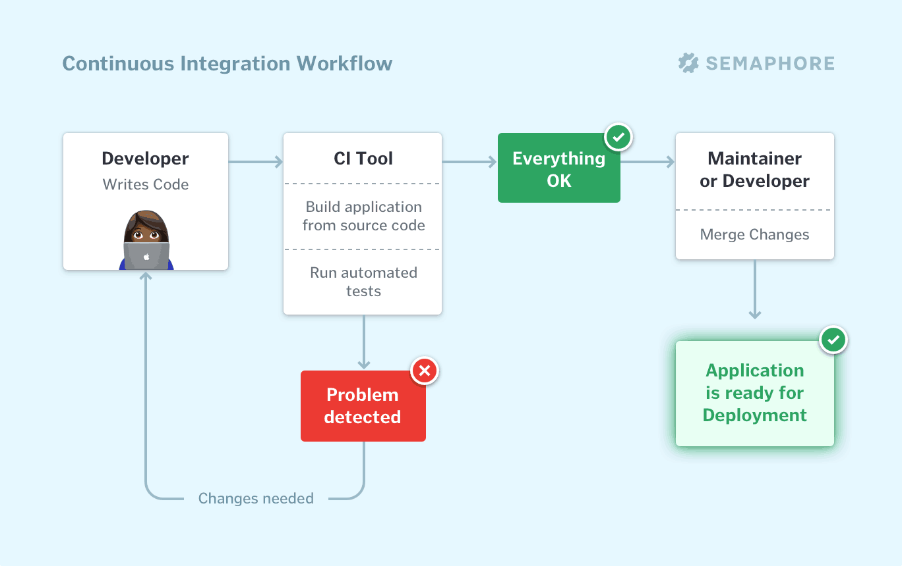

# Continuous Integration (CI)

- [Continuous Integration (CI)](#continuous-integration-ci)
	- [What](#what)
	- [Why](#why)
	- [How](#how)
	- [Example workflow](#example-workflow)
	- [Team responsibilities](#team-responsibilities)
	- [Example](#example)

## What

- the practice of automating the integration of code changes from multiple contributors into a single software project.
- he CI process is comprised of automatic tools that assert the new code’s correctness before integration.
- A source code version control system is the crux of the CI process.
- The version control system is also supplemented with other checks like automated code quality tests, syntax style review tools, and more.
- development practice that requires developers to integrate code into a shared repository several times a day
- the process of automating the build and testing of code every time a team member commits changes to version control

## Why

- By integrating regularly, you can detect errors quickly, and locate them more easily.
- Because you’re integrating so frequently, there is significantly less back-tracking to discover where things went wrong
  -  can spend more time building features.
- Continuous Integration is cheap
- No CI, leads to longer periods between integrations. This makes it exponentially more difficult to find and fix problems.
- Increase visibility enabling greater communication
- Catch issues early and nip them in the bud
- Stop waiting to find out if your code’s going to work
  - Especially just before deployment
-  deliver software more rapidly
- Waiting days or weeks to integrate code creates many merge conflicts, hard to fix bugs, diverging code strategies, and duplicated efforts.
  - CI avoids this by integrating early and often
- CI keeps the master branch clean

## How

- Maintain a single source repository
- Automate the build
  - Use a CI tool that has a hook to your git repo on master branch
  - Tools like jenkins, teamcity, gocd
- Make your build self-testing
- Every commit should build on an integration machine
- Keep the build fast
- Test in a clone of the production environment
- Make it easy for anyone to get the latest executable version
- Everyone can see what’s happening
- Automate deployment

## Example workflow

- Developers check out code into their private workspaces
- When done, commit the changes to the repository
- The CI server monitors the repository and checks out changes when they occur
- The CI server builds the system and runs unit and integration tests
- The CI server assigns a build/binary label to the version of the code it just built
- The CI server releases deployable artefacts stored in an artefact repository for testing
- The CI server informs the team of the successful build
- If the build or tests fail, the CI server alerts the team
- The team fixes the issue at the earliest opportunity
- Continue to continually integrate and test throughout the project

## Team responsibilities

- Check in frequently
- Don’t check in broken code
- Don’t check in untested code
- Don’t check in when the build is broken
- Don’t go home after checking in until the system builds

## Example

