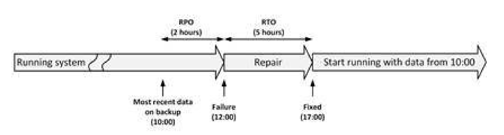

# Infrastructure Availability

- Everyone expects their infrastructure to be available all the time.
  - A 100% guaranteed availability of an infrastructure, however, is impossible
  - there is always a chance of downtime

## calculating availability

- In general, availability can neither be calculated, nor guaranteed upfront.
  - It can only be reported on afterwards, when a system has run for some years.
  - We use past experience and design patterns to design high available systems
    - ie failover, redundancy, structured programming, avoiding Single Points of Failures (SPOFs), and implementing
     sound systems management

### Availability percentages and intervals

- The availability of a system is usually expressed as a percentage of uptime in a given time period
  - ie month/year
  - ie for 99.9% uptime, we expect downtime of 17.5 hours per year, 86.2 min per month and 20.2 min per week
- Typical requirements used in service level agreements today are 99.8% or 99.9%
availability per month for a full IT system.
  - To meet this requirement, the availability of the underlying infrastructure must be much higher, typically in the range of 99.99% or higher
- 99.999% uptime is also known as carrier grade availability;
  - originates from telecommunication system components, not full systems
- Higher availability levels for a complete system are very uncommon, as they are almost impossible to reach.
  - ie average electricity supply downtime in uk is 75 min, therefore 99.9857% available
- Downtime does not mean it occurs in one event
  - down time could occur in multiple ranges ie 0-x1, x1 - x2 ....xn-1 to x
  - **good practice to agree on the maximum frequency of unavailability**
    - ie 0-5 min has 30 or less events per year, more than 30 min has 1 or less event per year

### MTBF and MTTR

- Two factors invovled in calculating availability
  - Mean Time Between Failures(MTBF)
    - which is the average time that passes between failures
    - expressed in hours
      - how many hours will the component or service work without failure
    - Impossible to test to find value, numbers are too large
      - manufacturers run tests on large batches of components.
        - ie  hard disks, 1000 disks could have been tested for 3 months. If in that period of time five disks fail
        , then MTBF can be calculated
    - MTBF only says something about the chance of failure in the first months of use.
      - an extrapolated value for the probable downtime of a disk
    - better to specify the annual failure rate instead
      -  ie 2% of all disk will fail in first year
      - Do another table of rates for each year
  - Mean Time To Repair (MTTR)
    - which is the time it takes to recover from a failure
    - When a component breaks, it needs to be repaired.
      - Usually the repair time (expressed as Mean Time To Repair – MTTR) is kept low by having a service contract
       with the supplier of the component.
      - Sometimes spare parts are kept onsite to lower the MTTR
      - Typically, a faulty component is not repaired immediately
        - A process occurs before repair ie
          - Notification of the fault (time before seeing an alarm message)
          - Processing the alarm
          - Finding the root cause of the error
          - Looking up repair information
          - Getting spare components from storage
          - Having technician come to the datacenter with the spare component
          - Physically repairing the fault
          - Restarting and testing the component
    - The best way to keep the MTTR low is to introduce automated redundancy and failover
  - These are statistically calculated values
- Decreasing MTTR and increasing MTBF both increase availability.
- Dividing MTBF by the sum of MTBF and MTTR results in the availability
- To reach five nines of availability the repair time should be as low as 90 minutes for a component (if MTBF is 150
,000 hrs)
  - if 5 9s for a year then the repair time must be 6 minutes
- As system complexity increases, usually availability decreases.
- serial availability
  - When a failure of any one part in a system causes a failure of the system as a whole
  - To calculate the availability of such a complex system or device, multiply the availability of all its parts
   (convert % to dec first)
  - This is lower than the availability of any single component in the system
    - it can never be higher, and only reach a maximum of the lower % if all availablity are same number
- To increase the availability, systems (composed of a various components) can be deployed in parallel.
  - The combined system no longer contains a Single Point Of Failure
  - If one component goes down in one system, the other system can take over until the first system's componet is
   fixed and brough back up
  - In this situation, it is important to have no single point of failure that combines the set of systems
    - for instance, all systems run on the same power supply

## Human Errors and Availability

- Usually only 20% of the failures leading to unavailability are technology failures
  - The rest are people and process issues
    - 50% of this is via change/configuration/release integration and hand-off issues
- Need to have highly qualified and trained staff, with a healthy sense of responsibility.
  - Errors are human, they will always happen
- Exampls
  - End users can introduce downtime by misuse of the system
    - When a user for instance starts the generation of ten very large reports at the same time, the performance of
     the system could suffer in such a degree that the system becomes unavailable to other users
    - hen a user forgets a password she is locked out and the system is unavailable for that user, being locked out
     could mean that a business process is unavailable to other users as well
- Most unavailability issues, however, are the result of actions from systems managers.
  - examples
    - Performing a test in the production environment
    - Switching off the wrong component - not the defective server that needs repair, but the one still operating
    - Swapping out the wrong component instaed of the faulty ones
    - Restoring the wrong backup tape to production
    - Accidentally removing files (mail folders, configuration files) or database entries
    - Making incorrect changes to configurations
    - Incorrect labeling of cables, later leading to errors when changes are made to the cabling.
    - Performing maintenance on an incorrect virtual machine
    - Making a typo in a system command environment
    - Insufficient testing, for instance, the fallback procedure to move operations from the primary datacenter to
     the secondary was never tested, and failed when it was really needed
  - Many of these mistakes can be avoided by using proper systems management procedures
    - having a standard template for creating new servers
    - using formal deployment strategies with the appropriate tools
    - using administrative accounts only when absolutely needed
    - Warning signs given to root users, to keep them aware
- Hackers can create downtime by for instance executing a Denial of Service attack

## Bugs

- software bugs are the number two reason for unavailability
- the complexity of most software it is nearly impossible (and very costly) to create bug-free software
- Bugs in systems or drivers can
  - stop an entire system
  - create downtime
- operating systems contain bugs that can lead to corrupted file systems, network failures, or other sources of
 unavailability
- These can be
  - accidental
    - something breaks in production and fixed later on in the software so does not happen again
  - accepted and have a manual way of dealing with them, as cheaper
  - on purpose by dissatisfied worker, spy, hacker. But will be spotted and fixed when the bug surfaces
    - Although can be costly, so prevention is better ie code reviews, access to code base to specific members etc

## Planned Maintenance

- Planned maintenance is sometimes needed to perform
    - systems management tasks like upgrading hardware or software,
    - implementing software changes
    - migrating data
    - the creation of backups
- planned maintenance should only be performed on parts of the infrastructure while other parts keep serving clients.
  - to maintain high availability
  - downtime of a single component does not lead to downtime of the entire system
    - if not single point of failure
    - Allows for upgrade of say OS while system is still up
- During planned maintenance, however, the system is more vulnerable to downtime than under normal circumstances
  - When the systems manager makes a mistake during planned maintenance, the risk of downtime is higher than normal
  - can lead to creating SPOF
- Example
  -  the upgrade of systems in a high available cluster. When one component is upgraded and the other is not upgraded yet, it could be that the high available cluster is not working as such. In that period of time the system is vulnerable to downtime

## Physical defects

- everything breaks down eventually, but mechanical parts are most likely to break first.
- Apart from mechanical failures because of normal usage, parts also break because of external factors like ambient temperature, moist, vibrations, and aging.
- In most cases the availability of a component follows a so-called bathtub curve.
  - A component failure is most likely when the component is new. In the first month of use the chance of a components failure is relatively high. Sometimes a component doesn't even work at all when unpacked for the first time.
    - This is called a DOA component – Dead On Arrival
  - When a component still works after the first month, it is likely that it will continue working without failure until the end of its technical life cycle
  -  the chance of failure rises suddenly at the end of the life cycle of a component.

## Environmental issues

- Issues with power and cooling, and external factors like fire, earthquakes and flooding can cause entire datacenters to fail.
  - Affect of power, being cut (foor long /short time periods ), or voltage drops/spikes
  - Failure of air con, causes temperature raise, which cause parts to break or slow down

## Complexity of the infrastructure

- Complex systems inherently have more potential points of failure and are more difficult to implement correctly.
- a complex system is harder to manage; more knowledge is needed to maintain the system and errors are made more easily.
- Sometimes it is better to just have an extra spare system in the closet than to use complex redundant systems

##  Availability patterns

- A single point of failure (SPOF) is a component in the infrastructure that, if it fails, causes downtime to the entire system.
  - SPOFs should be avoided, need to eliminate them
- The trick is to find SPOFs that are not that obvious
- it is not always feasible or cost effective.
- it is good to realize that there is always something shared in an infrastructur
  - We just need to know what is shared and if the risk of sharing is acceptable
- To eliminate SPOFs, a combination of redundancy, failover, and fallback

### Redundacy

- Redundancy is the duplication of critical components in a single system, to avoid a SPOF.
- usually implemented in power supplies, network interfaces, and SAN HBAs (Host Bus Adapters) for connecting storage.

### Failovers

- Failover is the (semi)automatic switch-over to a standby system (component), either in the same or in another datacenter, upon the failure or abnormal termination of the previously active system (component)

### Fallback

- Fallback is the manual switchover to an identical standby computer system in a different location, typically used for disaster recovery.
- three basic forms of fallback solutions
  - Hot site
    - is a fully configured fallback datacenter, fully equipped with power and cooling. The applications are installed on the servers, and data is kept up todate to fully mirror the production system.
    - Staff and operators should be able to walk in and begin full operations in a very short time (typically one or two hours).
    - requires constant maintenance of the hardware, software, data, and applications to be sure the site accurately mirrors the state of the production site at all times.
  - Warm site
    - A warm site could best be described as a mix between a hot site and cold site.
    - is a computer facility readily available with power, cooling, and computers, but the applications may not be installed or configured
    -  external communication links and other data elements, that commonly take a long time to order and install, will be present
    - To start working in a warm site, applications and all their data will need to be restored from backup media and tested. This typically takes a day
    - needs less attention when not in use and is much cheaper than a hot site
  - Cold site
    - it is ready for equipment to be brought in during an emergency, but no computer hardware is available at the site.
    - is a room with power and cooling facilities, but computers must be brought on-site if needed, and communications links may not be ready. Applications will need to be installed and current data fully restored from backups.
    - if an organization has very little budget for a fallback site, a cold site may be better than nothing

### Business Continuity

- the availability of the IT infrastructure can never be guaranteed in all situations
- Business continuity is about identifying threats an organization faces and providing an effective response
  - Business Continuity Management (BCM) and Disaster Recovery Planning (DRP) are processes to handle the effect of disasters
  - Business Continuity Management
    - managing business processes, and the availability of people and work places in disaster situations.
    - disaster recovery, business recovery, crisis management, incident management, emergency management, product recall, and contingency planning
    -  Business Continuity Plan (BCP) describes the measures to be taken when a critical incident occurs in order to continue running critical operations, and to halt non-critical processes
    - guidlines like BS:25999
  - Disaster Recovery Planning
    - a set of measures to take in case of a disaster, when (parts of) the IT infrastructure must be accommodated in an alternative location.
    - DRP assesses the risk of failing IT systems and provides solutions
    - IT disaster is defined as an irreparable problem in a datacenter, making the datacenter unusable
      - The first category is natural disasters such as floods, hurricanes, tornadoes or earthquakes.
      - The second category is manmade disasters, including hazardous material spills, infrastructure failure, or bio-terrorism
    - disaster recovery standard BS:25777 can be used to implement DRP
    - A typical DRP solution is the use of fallback facilities and having a Computer Emergency Response Team (CERT) in place.
      - A CERT is usually a team of systems managers and senior management that decides how to handle a certain crisis once it happens
    - One of the first worries is to save people during a diaster.
      - But after that, procedures must be followed to restore IT operations as soon as possible

    - RTO - Recovery Time Objective
      - he maximum duration of time within which a business process must be restored after a disaster, in order to avoid unacceptable consequences (like bankruptcy).
      - only valid in case of a disaster and not the acceptable downtime under normal circumstances.
      - failover and fallback used
    - RPO - Recovery Point Objective
      - The point in time to which data must be recovered considering some "acceptable loss" in a disaster situation.
      - the amount of data loss a business is willing to accept in case of a disaster, measured in time.
      - Different backup regimes will affect this
