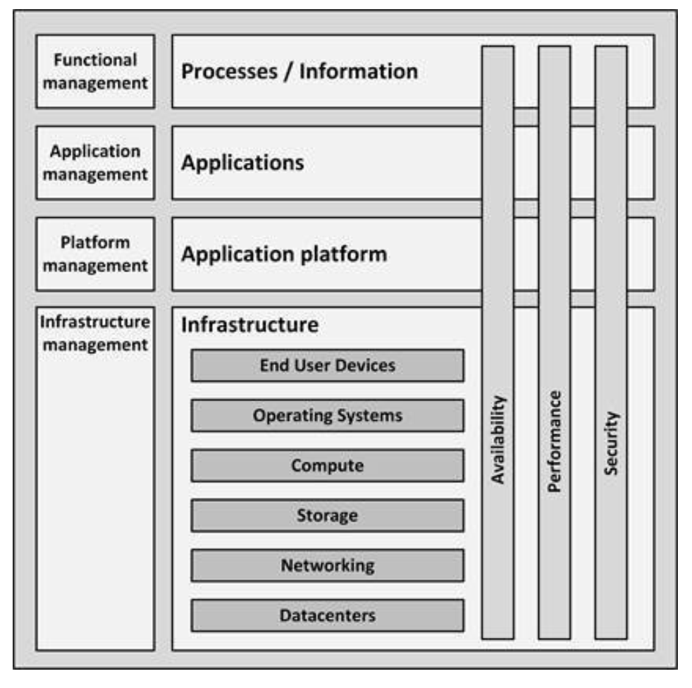

# IT Infrastructure Model

- In this model processes use information,
- this information is stored and managed using applications.
- Applications need application platforms and infrastructure to run.
- All of this is managed by various categories of systems management.

## Process/Information block

- Organizations implement business processes to fulfil their mission and vision.
  - Business features, that are implemented into the software system, deployed and used by the user/business
- processes are organization specific
  - example, some business processes in an insurance company could be:
    - claim registration, claim payment, and create invoice.
- Business processes create and use information (update, transform, validate, combine, apply rules to).
  - Information is typically entered, stored and processed using applications
- **Functional management** is the category of systems management that ensures the system is configured to perform the needed business functions

## Applications building block

- Includes 3 types:
  - Client applications typically run on end user devices like PCs and laptops.
    - Examples:
      - web browsers
        - applications running in web browser ie websites
      - word processors
      - email clients
      - games
  - Office applications provide standard server based applications most organizations use.
    - Examples:
      - mail servers
      - portals
      - collaboration tools
      - instant messaging servers.
    - Most organizations run these office applications more or less out of the box.
  - Business specific applications are applications that are typically highly customized or custom built.
    - Commonly known as enterprise applications
    - Examples:
      - Customer Relationship Management (CRM)
      - Enterprise Resource Planning (ERP)
      - Supervisory Control And Data Acquisition (SCADA) systems
      - applications that are created for a specific business process
        - like an insurance management system
- Applications management is responsible for the configuration and technical operations of the applications.

## Application Platform building block

- Most applications need some additional services, known as application
platforms, that enable them to work
- Types of services
  - Front-end servers
    - are typically web servers that provide end users with interactions to applications by presenting application screens in web browsers.
    - like Apache HTTP Server and Microsoft Internet Information Services – IIS
  - Application servers
    - act as containers running the actual application.
    - Examples
      - Java or .Net application servers
      - frameworks like IBM WebSphere, Apache Tomcat, Red Hat JBoss, and Windows .Net
  - **Connectivity** entails:
    - FTP servers
    - Extraction
    - Transformation
    - Load (ETL) servers
    - Enterprise Service Buses (ESBs)
      -  like Microsoft BizTalk, the TIBCO Service Bus, IBM MQ, and SAP NetWeaver PI
  - **Databases**, also known as database management systems (DBMSs),
    - provide a way to store and retrieve structured data.
      - Examples are Oracle RDBMS, IBM DB2, Microsoft SQL Server, PostgreSQL, and MySQL.
- Application platforms are typically managed by systems managers specialized in
the specific technology

## Infrastructure building blocks

- Types
  - End User Devices
    - are the devices used by end users to work with applications,
    - like PCs, laptops, thin clients, mobile devices, and printers.
  - **Operating Systems** are collections of programs that manage a
computer’s internal workings: its memory, processors, devices, and file
system.
  - **Compute** are the physical and virtual computers in the datacenter, also known as servers.
  - **Storage** are systems that store data.
    - They include hard disks, tapes, Direct Attached Storage (DAS), Network Attached Storage (NAS), and Storage Area Networks (SANs)
  - **Networking** connects all components.
    - Includes routers, switches, firewalls, WANs (wide area networks), LAN, dial-in, internet access, and VPNs (Virtual Private Network), and (on the network application level) relatively simple services like DNS, DHCP, and time services, necessary for the infrastructure to work properly.
  - **Datacenters** are locations that host most IT infrastructure hardware.
    - Include facilities like uninterruptible power supplies (UPSs), Heating, Ventilation, and Air Conditioning (HVAC), computer racks, and physical security measures
- Infrastructure management includes processes like ITIL and DevOps, and tools
like monitoring, backup, and logging

## Non functional attributes (NFA)

- Cross cutting concerns, spread over multiple blocks
- An IT system does not only provide functionality to users
  - ie provide this business function like buy a product
- functionality is supported by non-functional attributes
- Non-functional attributes are the effect of the configuration of each IT system component, both on the infrastructure level and above.
- The many NFAs, but the main ones that apply to all systems (but different levels for differetn systems ) are availability, performance, and security
