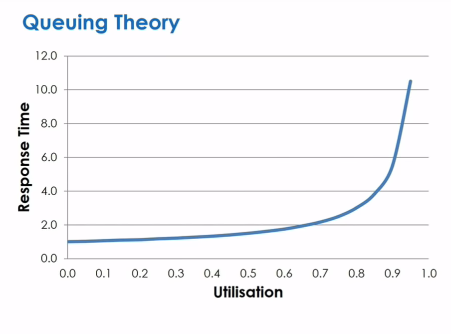

# [“Designing for Performance” by Martin Thompson](https://youtu.be/03GsLxVdVzU)

https://mechanical-sympathy.blogspot.com/

In the past pre 2005, we had moore's/Hause law, which stated processor speed would double every 18 months. But then physics intervened, and this cannot happen any more. So the birth of parallel cpus. Then use of software/ML to make the cpus smarter, and faster. But Google found this is a security issue, so the cpus had to reduce their performance by remove the smartness.

Cannot just rely on hardware, especially if the performance requirements hits the hardware limit.

## What is Performance?

Many aspects:

*   throughput
*   service time (time for processing an item)
*   latency, response time (service time + wait time in a queue)
*   scalability (touches on performance)

These aspects are not independent e.g. increasing throughput can cause latency to increase (which seemed fine at low throughput)

### Little's Law

WIP = Throughput x Cycle Time

### Queueing Theory

System utilization vs response time is not linear: 

*   We can reduce utilization if we **reduce service time**
*   We need to **make sure there’s capacity** so as to not reach above that 70% too often. To avoid slowing down and being more responsive

### Parallel Speedup

Parallel can help but don’t forget Amdahl’s law; how much of a request can be processed in parallel?

*   50% parallelizable task: max 2x speedup
*   95% parallelizable task: max 20x speedup

### Universal Scalability Law

Amdahl didn’t take into account the sync overhead of parallel tasks (sharing common world view): the coherence penalty.

Coherence penalty increases as parallelism increases (e.g. more CPU, threads, machines).

At some point, the coherence penalty eats away at a good portion of the benefit.

AWS experiment with a normal 150 microsecond coherence penalty: 

### Penalties of Logging Frameworks

They usually cannot do any work in parallel.

## Clean & Representative

Anecdotally, clean code tends to also be performant

### Abstractions: Create Them When Certain of the Benefits

*   Big frameworks generally don’t deliver as much as they cost in terms of performance and understanding the code
*   Abstractions have a cost, they need to make sense and pay off, not just be convenient at the moment [pay off in sense of maintainable code?]
*   Avoid building abstractions too early: find at least 3 things that would fit the abstraction
*   Too-early abstractions can be bad abstractions: they can force new code to adhere to an abstraction that doesn’t fit the problem

### Leaky Abstractions

*   Abstractions should not be leaky but instead:
    *   “… the purpose of abstracting is not to be vague, but to create a new semantic level in which one can be absolutely precise (Dijkstra)

### Memory System Abstraction

Hardware perf:

*   accessing main memory: 65-100ns
*   accessing L1 cache: ~1ns

Hardware caching is counting on software behavior:

*   temporal: code/data will be reused in near future (e.g. loops)
*   spatial: things that work together will be near each other
    *   e.g. fields in a class are cohesive and therefore used in computations alongside each other; we’ll cache the entire object so as to increase cache hits
*   patterns of access: pre-fetch data based on access pattern assumptions

## Performance Ideas

### Coupling & Cohesion

*   bad cohesion: feature envy
    *   one class accesses members of another: maybe those member should be moved
*   fields should be where they are used
    *   allows spatial, temporal optimization
    *   anecdotally, 30% performance increase

### Relationships

*   Use the correct data structures for the correct behavior
*   Lists and maps are not enough

### Batching

Amortize the expensive costs using batches:

*   when doing something expensive, batch things to amortize
    *   e.g. writing logs to disk: allow a batcher to write several at once instead of one disk access per log line

### Branches

*   Branches hurt performance, even speculative execution can’t save us
*   Some unneeded branches are there because the code isn’t clean

### Loops

*   x86/x64 instructions are decoded into smaller micro-ops in the CPU
*   Decoding instructions is (relatively) expensive
*   Best to stay inside loops whose decoded form can fit inside the L0 cache (micro-ops cache)
    *   i.e. keep loops small, elegant, few branches

### Composition: Size Matters

*   Prefer smaller, focused things
*   Building things with **single responsibility**: easy to reuse in other contexts
*   More likely to inline

### APIs

*   Give the caller the choice: don’t impose a specific pattern
*   The caller can find optimizations that suit her

### Data Organization

*   Consider replacing array of objects (spread all over the heap) with a collection of arrays
    *   Each array representing a field
    *   Allows vectorization, memory optimizations
*   Embrace Set Theory
*   Embrace Functional Programming

## Performance Testing

*   Needs numeric targets, not just “faster”
    *   e.g. specific throughput
    *   e.g. specific latency at specific throughput
*   Know the limits of the software
    *   e.g. what throughput makes latency unacceptable

### Measuring Response Time

*   Averages are not sufficient
*   Histograms, quantile, percentile: much better

### Measure the Right Things

*   Bad idea: measuring the service time but not wait time
*   **Coordinated omission**

### Benchmarking

*   CPU performance counters
    *   exposes cache misses, branch misses
*   Run benchmarks as part of continuous integration

### Measuring Running System

*   Telemetry should be built into production system
    *   Counters of: queue lengths, concurrent users, exceptions, transactions, etc.
    *   Histograms of: response times, service times, queue lengths, concurrent users, etc.
*   See: Aeron system

“It does not matter how intelligent you are, if you guess and that guess cannot be backed by experimental evidence - then it is still a guess” - Feynman
