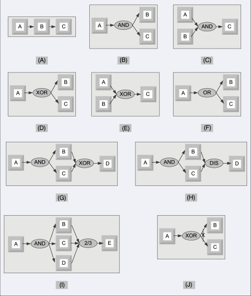

# Workflow Design Patterns

- Workflows are used in software applications to automate business processes.
- A workflow defines the sequence of steps or tasks that a business process should execute.
- The control flow workflow patterns describe the standard ways of task execution in a business process.
- Patterns used in use case to describe the behaviour

## links

- http://www.workflowpatterns.com/patterns/control/
- https://www.sciencedirect.com/topics/computer-science/workflow-pattern
- https://docs.aws.amazon.com/amazonswf/latest/awsrbflowguide/programming-workflow-patterns.html

## Types

- (a) Sequential
  - Several tasks follow after one another
  - Task A needs to be done first, then Task B then Task C
  - Blocking tasks.
    - Task C needs to wait for Task B and Task A to be finished before starting
- (b) And split
  - After Task A is done, several tasks can begin at the same time
  - These tasks may not finish at the same time
  - These can be done in parallel and on seperate threads or processes
- (c) Synchronization
  - several concurrent activities to terminate before an activity can start
  - Normally associated with (b)
  - Must wait for all tasks to finish
- (d) XOR split
  - requires a decision
  - after the completion of task A, either B or C can be activated
  - Some sort of if/else or case/switch or strategy pattern
- (e) XOR join
  - several alternatives are merged into one
  - in our example task C is enabled when either A or B terminates
  - Race condition determines flow
- (f) OR split
  - is a construct to choose multiple alternatives out of a set.
  - after completion of task A, one could activate either B or C, or both
- (g) multiple merge
  - allows multiple activations of a task and does not require synchronization after the execution of concurrent tasks.
  - Once A terminates, tasks B and C execute concurrently
  - When the first of them, say B, terminates, then task D is activated; then, when C terminates, D is activated again.
- (h) discriminator
  - waits for a number of incoming branches to complete before activating the subsequent activity
  - then it waits for the outgoing branches to finish without taking any action until all of them have terminated. Next, it resets itself.
- (i) N out of M join
  - provides a barrier synchronization
  - Assuming that M > N tasks run concurrently, N of them have to reach the barrier before the next task is enabled
  - any two out of the three tasks A, B, and C have to finish before E is enabled
- (j) deferred choice
  - the choice is not made explicitly and the run-time environment decides what branch to take,
