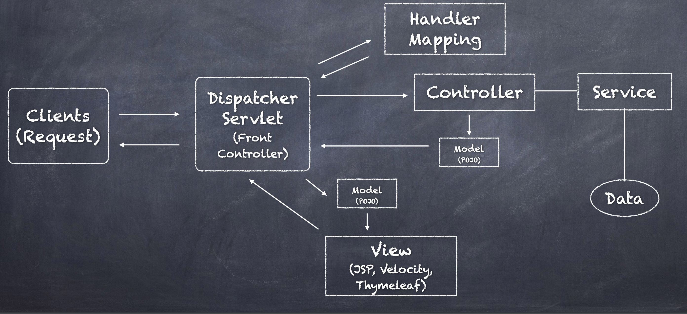

# Spring MVC



## Spring Controller

```java
@GetMapping("/blah")
@ResponseBody
public String getSomething() {
  return "Hello";
}
```

## View and Templating

```java
@Controller // Defines the component used by DI
public class BookController {

  @RequestMapping("/books") // Defines path
  public String getBooks(Model model) { // The model is what we return, and thus needs enriching, which is used by the view layer

    model.addAttribute("books", Set.of(new Book("blah", "foo", new Publisher("name")))));

    return "books/list";// Refers to the template
  }
}
```

In resources/templates/books, add list.html

```html

<!DOCTYPE html>
<html lang="en" xmlns:th="http://www.thymeleaf.org">
<head>
  <meta charset="UTF-8"/>
  <title>Spring Framework Guru</title>
</head>
<body>
<h1>Book List</h1>

<table>
  <tr>
      <th>ID</th>
      <th>Title</th>
      <th>Publisher</th>
  </tr>
  <tr th:each="book : ${books}">
      <td th:text="${book.id}">123</td>
      <td th:text="${book.title}"> Spring in Action</td>
      <td th:text="${book.publisher.name}">Wrox</td>
  </tr>
</table>

</body>
</html>
```

this reads model, and the objects and create the output
