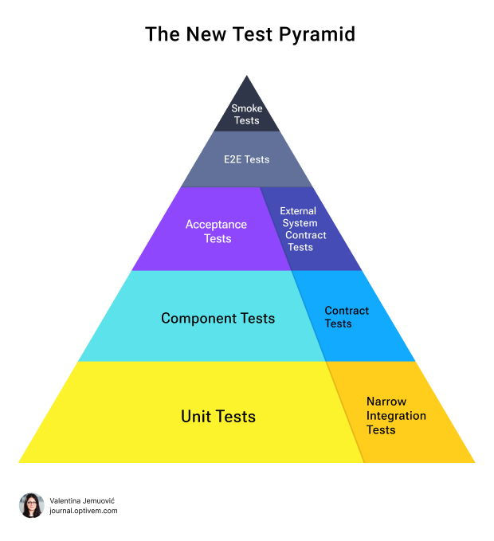

# Test Pyramids

## Classic Testing pyramid

* More resource expensive and time consuming tests at the top (few of them). Cover less, but make sure everything fits and works together.
* More unit tests, less expensive, mocked/stubbed, fast running tests at the bottom. Cover more of the code base.

- https://blog.ncrunch.net/post/testing-pyramid-automated-testing.aspx
- https://khushiy.com/2019/02/07/test-pyramid-antipatterns/
- https://github.com/mesmacosta/test-pyramid

### issues

- Overuse of E2E tests, often reaching the Inverted Test Pyramid
- No consensus on the definition of Integration Tests, and over-reliance on large scoped integration tests makes it hard to maintain
- No consensus on the definition of Unit Tests, and writing unit tests that are structurally coupled to code with over-mocking, thus fragile when refactoring
- The Test Pyramid does not include Acceptance Tests needed for testing Acceptance Criteria, but instead it relies on fragile E2E Tests for that
- The Test Pyramid doesn’t provide us guidance for testing microservices, specifically it doesn’t even mention Component Tests & Contract Tests which are crucial for microservice testing

- https://blog.devgenius.io/what-is-the-problem-of-testing-pyramid-model-7fe7612a02e8
- https://johnfergusonsmart.com/test-pyramid-heresy/

## Testing Hourglass

- As software projects grow, often the shape of our test pyramid distribution becomes undesirable, either top heavy (no unit or medium integration tests), or like an hourglass.
- The hourglass test distribution has a large set of unit tests, a large set of end-to-end tests, and few or no medium integration tests.
- To transform the hourglass back into a pyramid — so that you can test the integration of components in a reliable, sustainable way — you need to figure out how to architect the system under test and test infrastructure and make system testability improvements and test-code improvements.
-
## Trophy Pyramid

- ROI is better to have more integration tests, than unit tests.
    - Int tests cost more and slower than unit tests. But need to write more unit tests, to match one Int test
- Rely on static typing and compiler to handle syntax and language errors
    - use of static analysis tools
    - Dont test business logic
- Unit tests
    - to test edge cases
- Integration tests
    - to handle business flows or integration points ie database, http calls
    - test multiple areas at once
    - make sure that parts of system work together
    - Less mocking, more real objects used
- End to End test
    - Bring up whole app, test user flows
    - critical paths
    - little to no mocking, some for services dont want to use
- Integration and end to end can be very fuzzy demarcation
- Reduce duplication of tests, if unit is tested via Integration or end to end test, it does not need to be retested
    - Makes code more brittle, more places to change code
- If test does something that your consumer of that code doesnt then it's testing implementation details
- If refactor breaks your tests, then it's testing implementation details

- https://kentcdodds.com/blog/the-testing-trophy-and-testing-classifications
- https://agiledojo.de/2021-02-18-test-pyramid-vs-testing-trophy_en/
- https://martinfowler.com/articles/2021-test-shapes.html
- https://www.baytechconsulting.com/blog/test-pyramid-vs-testing-trophy-whats-the-difference
- https://github.com/mesmacosta/test-pyramid/tree/master/pyramid-microservice/src/main/java/com/github/ricardocomar/testpyramid/microservice

## Testing Quadrant

- https://www.onpathtesting.com/blog/what-are-agile-testing-quadrants
- https://agiletester.ca/applying-the-agile-testing-quadrants-to-continuous-delivery-and-devops-culture-part-1-working-towards-continuous-delivery/

## New testing pyramid

- https://substack.com/@valentinajemuovic/p-150305128

## Links

- https://blog.usejournal.com/lean-testing-or-why-unit-tests-are-worse-than-you-think-b6500139a009
- https://kentcdodds.com/blog/write-tests